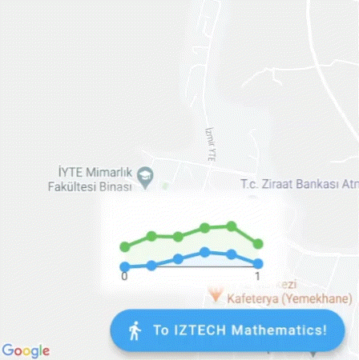

# Decorated Google Maps for Flutter (Developer Preview)
A Flutter package that provides a Decorated Google Maps widget with support for custom widgets that can show charts, visualizations, markers and more.



## Usage
1. Setup according to `google_maps_flutter` package.
2. Remove `google_maps_flutter` from `pubspec.yaml`.
3. Add `decorated_google_maps_flutter` to `dependencies` in `pubspec.yaml`.
4. Replace `import 'package:google_maps_flutter/google_maps_flutter.dart';` with `import 'package:decorated_google_maps_flutter/decorated_google_maps_flutter.dart';` in your Dart files.
5. Supply `List<Locationed>` to a `DecoratedGoogleMap` widget.

```dart
DecoratedGoogleMap(
  children: [
    Locationed(
      target: LatLng(38.3151102, 26.6374663),
      width: 64,
      height: 64,
      child: Container(),
    )
  ],
  mapType: MapType.normal,
  initialCameraPosition: CameraPosition(target: LatLng(38.3151102, 26.6374663)),
)
```

## Note
This package is a wrapper around while also exporting `google_maps_flutter` and is subject with regards to performance, customizations and usability. Please provide feedback to help it!

## Sample Usage
```dart
import 'dart:async';
import 'dart:math';

import 'package:flutter/material.dart';
import 'package:decorated_google_maps_flutter/decorated_google_maps_flutter.dart';
import 'package:charts_flutter/flutter.dart';

void main() => runApp(MyApp());

class MyApp extends StatelessWidget {
  @override
  Widget build(BuildContext context) {
    return MaterialApp(
      title: 'Flutter Google Maps Decorated Demo',
      home: DecoratedMapSample(),
    );
  }
}

class DecoratedMapSample extends StatefulWidget {
  @override
  State<DecoratedMapSample> createState() => DecoratedMapSampleState();
}

class DecoratedMapSampleState extends State<DecoratedMapSample>
    with SingleTickerProviderStateMixin {
  Completer<GoogleMapController> _controller = Completer();
  bool _mathematics = true;
  AnimationController _animation;

  static final CameraPosition _kIztechMathematics = CameraPosition(
    target: LatLng(38.3232783, 26.6326994),
    bearing: -80,
    zoom: 15,
  );

  static final CameraPosition _kIztechInnovation = CameraPosition(
    target: LatLng(38.3151102, 26.6374663),
    bearing: -10,
    zoom: 15,
  );

  @override
  void initState() {
    super.initState();
    _animation = AnimationController(
        duration: const Duration(milliseconds: 640), vsync: this)
      ..repeat(reverse: true)
      ..addListener(() {
        setState(() {});
      });
  }

  @override
  Widget build(BuildContext context) {
    return Scaffold(
      body: DecoratedGoogleMap(
        mapType: MapType.normal,
        initialCameraPosition: _kIztechMathematics,
        onMapCreated: (GoogleMapController controller) {
          _controller.complete(controller);
        },
        children: [
          Locationed(
            target: _kIztechMathematics.target,
            width: 192,
            height: 96,
            child: Container(
              decoration: BoxDecoration(
                color: Colors.white,
                backgroundBlendMode: BlendMode.overlay,
                boxShadow: <BoxShadow>[
                  BoxShadow(
                    color: Colors.white,
                    blurRadius: 8.0,
                    spreadRadius: 8.0,
                  ),
                ],
              ),
              child: LineChart(
                <Series<double, double>>[
                  Series(
                    id: 'Mathematics Blue',
                    colorFn: (_, __) => MaterialPalette.blue.shadeDefault,
                    domainFn: (var i, _) => i / pi,
                    measureFn: (var i, _) =>
                        pow(sin(i * (0.5 + _animation.value * 0.4)), 2.0) *
                        i /
                        pi,
                    data: [
                      for (var i = 0.0; i < pi + pi / 10.0; i += pi / 5.0) i
                    ],
                  ),
                  Series(
                    id: 'Mathematics Green',
                    colorFn: (_, __) => MaterialPalette.green.shadeDefault,
                    domainFn: (var i, _) => i / pi,
                    measureFn: (var i, _) =>
                        1.0 +
                        cos((i * 3.0 - pi * 2.2) *
                                (0.5 + _animation.value * 0.4) *
                                1.5) *
                            0.2,
                    data: [
                      for (var i = 0.0; i < pi + pi / 10.0; i += pi / 5.0) i
                    ],
                  )
                ],
                defaultRenderer: LineRendererConfig(
                  radiusPx: 6.0,
                  strokeWidthPx: 4.0,
                  includeArea: true,
                  includePoints: true,
                  stacked: true,
                ),
                animate: false,
                primaryMeasureAxis:
                    NumericAxisSpec(renderSpec: NoneRenderSpec()),
              ),
            ),
          ),
          Locationed(
            target: _kIztechInnovation.target,
            width: 128,
            height: 128,
            child: Container(
              decoration: BoxDecoration(
                color: Colors.white,
                backgroundBlendMode: BlendMode.overlay,
                boxShadow: <BoxShadow>[
                  BoxShadow(
                    color: Colors.white,
                    blurRadius: 4.0,
                    spreadRadius: 4.0,
                  ),
                ],
              ),
              child: PieChart(
                <Series<double, double>>[
                  Series(
                    id: 'Mathematics Blue',
                    colorFn: (_, __) => MaterialPalette.blue.shadeDefault,
                    domainFn: (var i, _) => i / pi,
                    measureFn: (var i, _) =>
                        0.5 + sin((i * (0.5 + _animation.value * 0.5))),
                    data: [
                      for (var i = 0.0; i < pi + pi / 8.0; i += pi / 4.0) i
                    ],
                  ),
                ],
                defaultRenderer: ArcRendererConfig(arcRatio: 0.5, strokeWidthPx: 4.0),
                animate: false,
              ),
            ),
          )
        ],
      ),
      floatingActionButton: FloatingActionButton.extended(
        onPressed:
            _mathematics ? _goToIztechInnovation : _goToIztechMathematics,
        label: _mathematics
            ? Text('To IZTECH Innovation')
            : Text('To IZTECH Mathematics!'),
        icon: Icon(Icons.directions_walk),
      ),
    );
  }

  Future<void> _goToIztechMathematics() async {
    final GoogleMapController controller = await _controller.future;
    controller
        .animateCamera(CameraUpdate.newCameraPosition(_kIztechMathematics));
    setState(() {
      _mathematics = true;
    });
  }

  Future<void> _goToIztechInnovation() async {
    final GoogleMapController controller = await _controller.future;
    controller
        .animateCamera(CameraUpdate.newCameraPosition(_kIztechInnovation));
    setState(() {
      _mathematics = false;
    });
  }
}
```